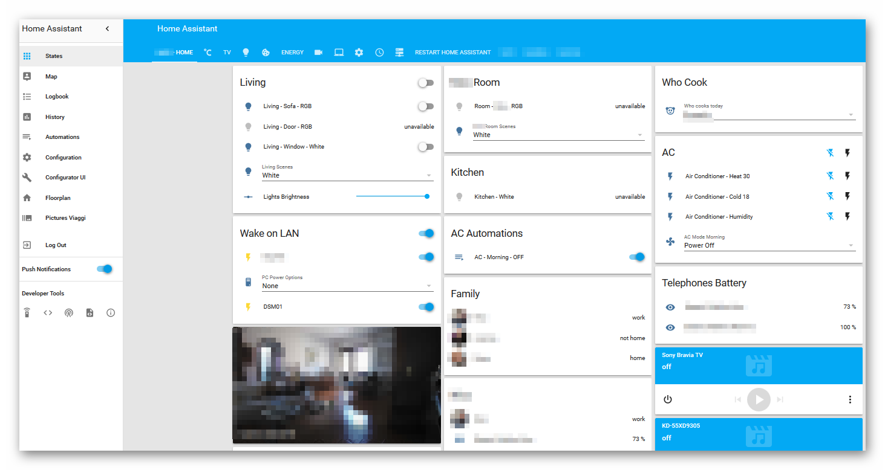

# Homeassistant Template Example By Ciquattro

Home assistant Configuration (YAMLs)

This is my Home Assistant Configuration created with a Docker Installation on a Synology DSM 713+ with an expanded 4GB ram.

- Android Devices (iPads, iPods, iPhones)
- Owntracks for presence detection and GPS logging
- Mitsubishi Air Conditioner
- Belkin IR Blaster - Mini R3
- Andorid TV
- Sony Bravia TV
- Fritbox
- Synology NAS
- Foscam R2 Camera
- Yeelight RGB and White Bulb
- Efergy for Energy cost monitor

- Telegram Notification
- FitBit Integration

